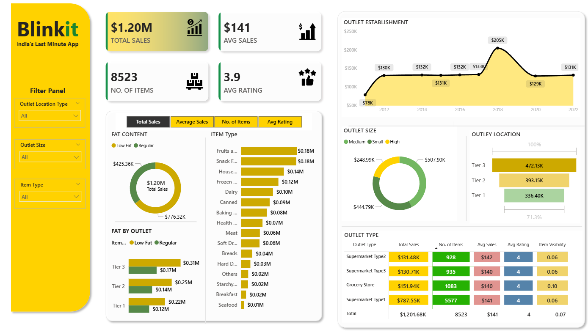

# Blinkit Sales Analysis Dashboard - Power BI

## Project Overview
This project is an interactive Blinkit Sales Analysis Dashboard developed using Power BI.

The dashboard provides detailed business insights into:
- Sales Performance
- Outlet Analysis
- Item Type Trends
- Outlet Size Distribution
- Customer Ratings
- Product Category Analysis

The dashboard is fully interactive and dynamically updates according to selected filters.

---

## Features

### KPI Cards
- Total Sales
- Average Sales
- Number of Items
- Average Rating

### Interactive Filters
- Outlet Location Type (Tier 1, Tier 2, Tier 3)
- Outlet Size (Small, Medium, High)
- Item Type Filtering

### Visual Analysis
- Outlet Establishment Trends
- Item Type Sales Analysis
- Fat Content Analysis
- Outlet Size Distribution
- Outlet Location Insights
- Outlet Type Comparison

---

## Tools & Technologies Used
- Power BI
- DAX
- Data Visualization
- Business Intelligence
- Data Cleaning

---

## Dashboard Insights
- Total sales exceeded $472K
- Tier 3 outlets generated the highest sales
- Supermarket Type1 contributed significantly to overall sales
- Medium-sized outlets showed strong performance
- Regular fat products generated higher sales compared to low-fat products

---

## Interactive Functionality

The dashboard dynamically changes according to selected filters and slicers.

### Tier-wise Analysis
- Tier 1 Outlet Analysis
- Tier 2 Outlet Analysis
- Tier 3 Outlet Analysis

### Outlet Size Analysis
- Small Outlet Analysis
- Medium Outlet Analysis
- High Outlet Analysis

### Item Type Analysis
- Food Category Analysis
- Snack Food Analysis

All KPI cards, charts, and visualizations update automatically based on filter selections.

---

## Files Included
- `.pbix` Power BI Dashboard File
- Dashboard Screenshots
- README Documentation

---

## Learning Outcomes
Through this project, I improved my skills in:
- Dashboard Designing
- Data Storytelling
- Interactive Reporting
- KPI Development using DAX
- Business Data Analysis
- Power BI Visualization Best Practices

---

## Author
Parth Shah

---

# Dashboard Preview

## Main Dashboard

---

# Interactive Dashboard Functionality

## Tier-wise Analysis

### Tier 1 Outlet Analysis
.png)

### Tier 2 Outlet Analysis
.png)

### Tier 3 Outlet Analysis
.png)

---

## Outlet Size Analysis

### Small Outlet Analysis
.png)

### Medium Outlet Analysis
.png)

### High Outlet Analysis
.png)

---

## Food Item Analysis

### Snack Food Analysis
.png)

---

## GitHub Repository
Power BI Dashboard Project for Data Analytics Portfolio
